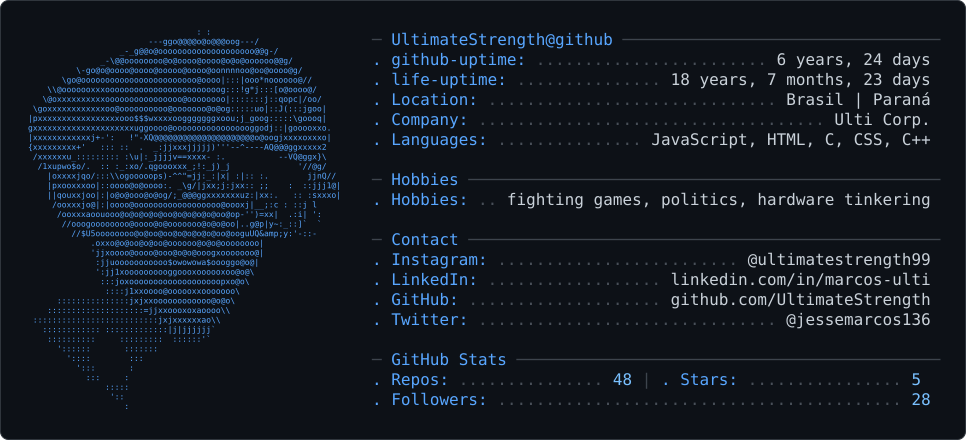

_%20Yo!%20I'm%20Marcos%20aka%20Ulti.%20();&desc=A%20programmer%20and%20coffee%20enthusiast%20in%20his%20spare%20time!%20☕&fontSize=50&section=header&reversal=false&textBg=false&fontColor=ffffff&animation=scaleIn&descSize=15" />

```bash
ultimatestrength@github ~ $ ./maintainer.sh
```

<br>

```bash
ultimatestrength@github ~ $ whoami
```

I'm a self-taught developer studying Systems Analysis & Development (2nd semester, IFPR), currently interning
in IT support and Google Workspace administration. I build practical stuff - shopping carts, interactive
quizzes, custom-logic interfaces - and lately I've been getting into automation and game dev on the side.

<p align="center">
  <a href="https://ultimatestrength.github.io/portfolio/">
    
  </a>
  <a href="https://buymeacoffee.com/marcos.ulti">
    
  </a>
</p>

```bash
ultimatestrength@github ~ $ cat stack.conf
```

<p align="center">
  
  
  
  
  
  
  
  
  
</p>

<p align="center">
  
  
  
  
  
  
</p>

<p align="center">
  
  
  
  
  
</p>

<!-- TODO: trem gerado pelo projeto do CONTEXTO3.md entra aqui, entre stack e contatos -->
<div align="center">
<!--  -->
</div>

```bash
ultimatestrength@github ~ $ toolbox --list
```

<p align="center">
  <a href="https://instagram.com/ultimatestrength99">
    
  </a>
  <a href="https://x.com/jessemarcos136">
    
  </a>
  <a href="https://linkedin.com/in/marcos-ulti">
    
  </a>
  <a href="https://github.com/UltimateStrength">
    
  </a>
</p>

<p align="center">
  
</p>

<br>

```bash
ultimatestrength@github ~ $ cat hobbies.txt
```

<div align="center">

<!-- TODO: substituir pelo card do fork do gh-ascii depois que o Claude Code
     terminar (life-uptime, hobbies, contatos extras, cor de destaque).
     Baixar dark_mode.svg + light_mode.svg da instância própria e commitar
     no repo, igual ao snake/space invaders. -->

<picture>
  <source media="(prefers-color-scheme: dark)" srcset="dark_mode.svg" />
  <source media="(prefers-color-scheme: light)" srcset="light_mode.svg" />
  
</picture>

</div>

<br>

<div align="center">


<!-- indeciso, ver com o Ulti se mantém:

-->

</div>

<br>

```bash
ultimatestrength@github ~ $ git log --graph --all
```

<div align="center">

<!-- indeciso, ver com o Ulti se mantém o snake junto do space invaders:

-->

<picture>
  <source media="(prefers-color-scheme: dark)" srcset="https://raw.githubusercontent.com/UltimateStrength/UltimateStrength/output/invaders-dark.svg" />
  <source media="(prefers-color-scheme: light)" srcset="https://raw.githubusercontent.com/UltimateStrength/UltimateStrength/output/invaders.svg" />
  
</picture>

</div>

```bash
ultimatestrength@github ~ $ _
```


